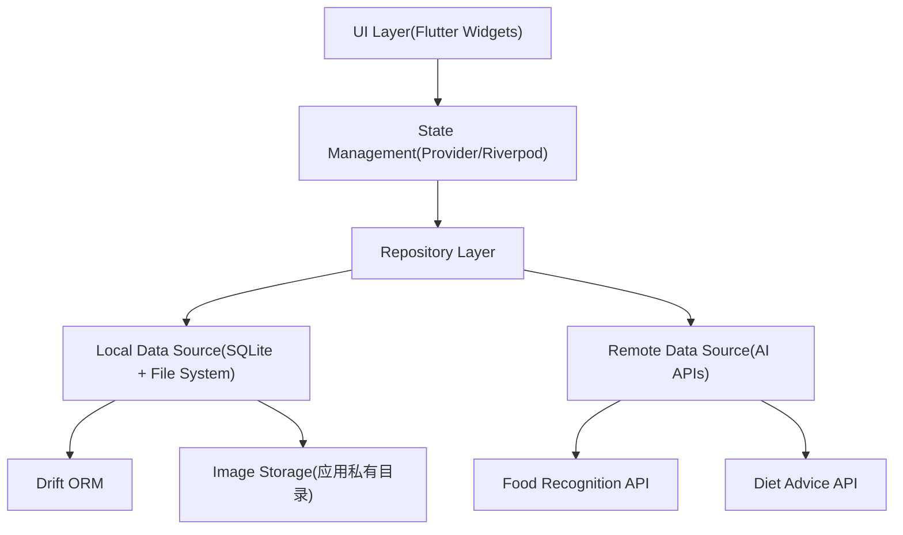
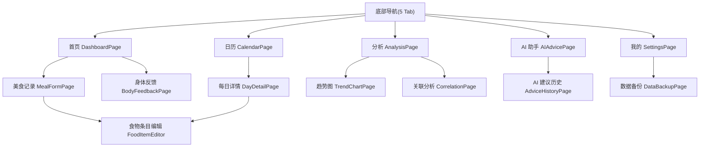
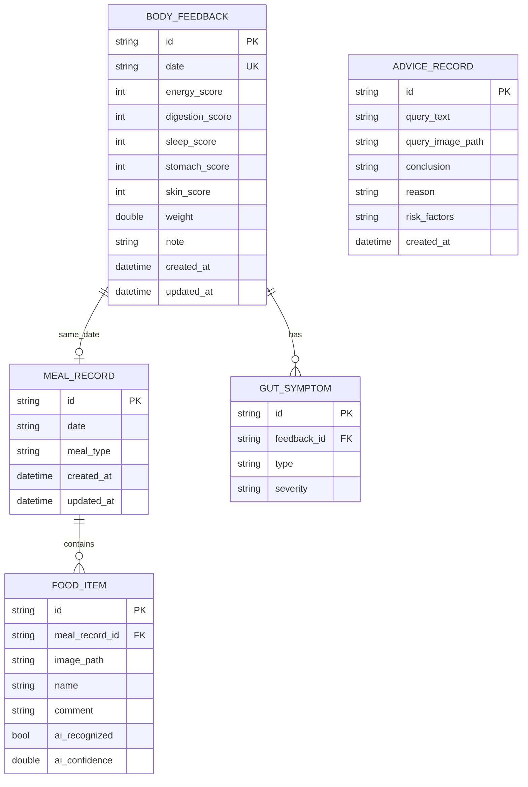

# AI 美食记录 + 身体反馈追踪 App

Feature Name: ai-food-journal-body-tracker
Updated: 2026-08-17

## Description

系统是一个 Flutter 跨平台移动应用，帮助用户拍照记录日常饮食，通过云端 AI 识别食物名称，并每日记录身体反馈（五维评分 + 体重 + 肠胃症状 + 备注）。系统提供日历视图、趋势分析与肠胃症状关联分析，并可基于用户历史记录向 AI 询问"这个食物我能不能吃"，获得个性化饮食建议。

系统采用纯本地存储方案：所有记录保存在设备本地 SQLite 数据库，图片保存在应用私有目录；仅 AI 识别与 AI 饮食建议调用云端 API。数据支持本地导出与恢复。

### 关键设计决策

| 决策点 | 选择 | 理由 |
|--------|------|------|
| 跨平台框架 | Flutter | 单一代码库发布 iOS/Android，UI 一致性强 |
| 本地存储 | SQLite（Drift ORM）+ 文件系统 | 纯本地方案，无需账号，数据隐私可控 |
| 状态管理 | Provider + Riverpod | Flutter 官方推荐，轻量易测试 |
| 图像识别 | 云端视觉 API（multipart 上传） | 识别准确率高，端侧无模型体积负担 |
| AI 饮食建议 | 云端 LLM API（文本上下文 + 历史摘要） | 基于历史记录个性化生成建议 |
| 图片存储 | 应用文档目录 + 数据库存路径 | 避免大文件入库拖慢查询 |
| 导航 | 底部 5 Tab + 页面栈 | 首页/日历/分析/AI 助手/我的 |

## Architecture

### 分层架构



### 页面导航结构



### 数据流

1. **记录美食**：UI 收集图片与文字 → Repository 调用本地识别（或跳过）→ 识别结果填充 → 校验 → 写入 SQLite + 图片落盘 → 刷新当日列表。
2. **AI 饮食建议**：UI 提交食物文本/图片 → Repository 从本地库聚合近 30 天记录摘要 → 调云端 LLM API → 保存建议历史 → 展示结论。

## Components and Interfaces

### 页面组件

| 组件 | 职责 | 关键输入 |
|------|------|---------|
| DashboardPage | 今日概览、记录入口、连续记录统计 | 今日日期 |
| MealFormPage | 一餐多食物的录入/编辑表单 | 目标日期、可选餐次 |
| FoodItemEditor | 单个食物条目（图片 + 名称 + 评价） | 图片、AI 识别结果 |
| BodyFeedbackPage | 五维评分 + 体重 + 肠胃症状 + 备注 | 目标日期 |
| GutSymptomPicker | 多症状选择与严重程度设置 | 症状列表 |
| DayDetailPage | 单日美食记录与身体反馈汇总 | 日期 |
| CalendarPage | 月历记录标记与日期跳转 | 月份 |
| TrendChartPage | 维度评分/体重折线图 | 维度、近 30 天数据 |
| CorrelationPage | 症状频率与疑似敏感食物分析 | 近 30 天记录 |
| AIAdvicePage | 提问与建议展示 | 食物文本/图片 + 历史摘要 |
| AdviceHistoryPage | AI 建议历史倒序列表 | 历史建议记录 |
| SettingsPage | 备份、恢复、关于 | — |
| DataBackupPage | 导出/导入备份文件 | — |

### Repository 接口

```dart
abstract class MealRepository {
  Future<MealRecord> saveMeal(MealRecord record);
  Future<List<MealRecord>> getMealsByDate(DateTime date);
  Future<MealRecord?> getMealById(String id);
  Future<void> updateMeal(MealRecord record);
  Future<void> deleteMeal(String id);
}

abstract class FeedbackRepository {
  Future<BodyFeedback> saveFeedback(BodyFeedback feedback);
  Future<BodyFeedback?> getFeedbackByDate(DateTime date);
  Future<void> updateFeedback(BodyFeedback feedback);
}

abstract class AdviceRepository {
  Future<AdviceRecord> saveAdvice(AdviceRecord record);
  Future<List<AdviceRecord>> getAdviceHistory({int limit});
}

abstract class AIService {
  Future<FoodRecognitionResult> recognizeFood(File image);
  Future<DietAdviceResult> getDietAdvice({
    required String query,
    String? imagePath,
    required String historySummary,
  });
}

abstract class BackupService {
  Future<File> exportAll();
  Future<void> importFrom(File file);
}
```

### AI API 接口

**食物识别**
```
POST /v1/food/recognize
Content-Type: multipart/form-data
Body: image=<binary>

200 Response:
{
  "name": "红烧肉",
  "confidence": 0.92,
  "candidates": [{"name": "红烧肉", "confidence": 0.92}]
}
```

**饮食建议**
```
POST /v1/diet/advice
Content-Type: application/json
Body:
{
  "query": "这个我能吃吗",
  "image_base64": "...",        // 可选
  "history_summary": "近30天饮食与症状摘要"
}

200 Response:
{
  "conclusion": "谨慎食用",
  "reason": "该食物曾引发腹痛",
  "risk_factors": ["高油脂", "刺激性"]
}
```

## Data Models

### 实体关系



### 字段约束

| 字段 | 类型 | 约束 |
|------|------|------|
| mealRecord.date | String(yyyy-MM-dd) | 必填 |
| mealRecord.mealType | String | breakfast/lunch/dinner/snack |
| foodItem.imagePath | String | 必填，应用私有目录内相对路径 |
| foodItem.name | String | 必填 |
| foodItem.aiConfidence | double? | 0.0~1.0，手动填写为空 |
| feedback.date | String(yyyy-MM-dd) | 唯一，单日一条 |
| feedback.energyScore~skinScore | int? | 1-5，可空 |
| feedback.weight | double? | 大于 0，可空 |
| gutSymptom.type | String | 枚举：腹泻/便秘/胀气/腹痛/反酸/恶心/食欲不振 |
| gutSymptom.severity | String | 轻度/中度/重度 |
| adviceRecord.conclusion | String | 建议食用/谨慎食用/不建议食用 |

### 图片存储

- 图片写入 `{应用文档目录}/images/{yyyy}/{MM}/{mealRecordId}/{foodItemId}.jpg`
- 数据库仅保存相对路径，展示时拼接绝对路径
- 备份文件包含图片目录 + 数据库导出的 JSON

## Correctness Properties

1. 单日最多存在一条 BODY_FEEDBACK 记录（date 唯一约束兜底）。
2. 一条 MEAL_RECORD 至少包含一个 FOOD_ITEM；FOOD_ITEM 必须属于一条 MEAL_RECORD。
3. 评分维度值域为 1-5；超出或为空（未选）时按未评分处理。
4. 体重必须大于 0，保留一位小数。
5. 删除 MEAL_RECORD 级联删除其 FOOD_ITEM 及关联图片文件。
6. 删除 BODY_FEEDBACK 级联删除其 GUT_SYMPTOM。
7. 备份文件 JSON 与图片目录需同步导出；导入时校验格式，失败不影响现有数据。
8. AI 建议历史按创建时间倒序展示，结论必为三档之一。

## Error Handling

| 场景 | 处理策略 |
|------|---------|
| AI 识别失败/超时 | 提示识别失败，食物名称输入框保持可编辑，允许手动填写 |
| 网络不可用 | 跳过 AI 识别，直接进入手动填写流程 |
| AI 饮食建议失败 | 展示失败提示与重试按钮，不写入建议历史 |
| 建议历史数据不足 | AI 返回结论时附加"参考价值有限"提示，建议继续记录 |
| 保存时校验失败 | 高亮缺失必填项，不写入数据库 |
| 数据库写入异常 | 回滚事务，提示保存失败，保留页面输入 |
| 备份文件损坏 | 提示恢复失败，现有数据不受影响 |
| 图片写入失败 | 提示图片保存失败，阻止保存该食物条目 |

## Test Strategy

| 层级 | 覆盖内容 |
|------|---------|
| 单元测试 | 数据模型序列化、评分/症状枚举校验、餐次默认值推断、备份 JSON 生成与解析 |
| Repository 测试 | 增删改查、单日唯一约束、级联删除、日期过滤（内存数据库） |
| 状态层测试 | 表单校验流、AI 识别结果填充、失败兜底手动填写 |
| Widget 测试 | 美食表单、症状选择器、日历标记、趋势图空数据提示 |
| 集成测试 | 记录美食 → 记录身体反馈 → 日历标记 → 每日详情 → 编辑 → 删除 全链路 |
| AI 服务测试 | Mock API 的成功/超时/失败分支；历史摘要聚合正确性 |

## References

[^1]: (requirements.md) - [PRD 需求文档](../ai-food-journal-body-tracker/requirements.md)
